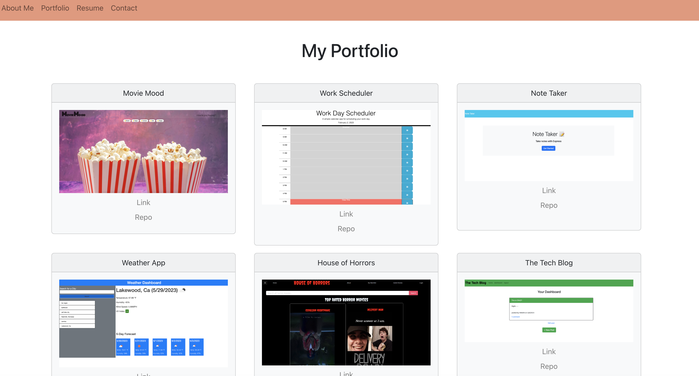

# Nathaniel-React-Portfolio
## Description
#
This React portfolio lets the user view my latest projects and skills I've learned throughout UCI's coding bootcamp. The header includes links for my resume, contact information, and 'about me' page. 

## Installation 
#
This app was created using React, react-icons, Bootstrap, javascript, and CSS.
## Usage
#
The app automatically opens on the 'about me' page. If the user clicks on the portfolio tab - the page is populated with six of my recent projects. Each project card includes its deployment and repo link. The resume page includes the coding skills acquired through the bootcamp: front end, back end, and database knowledge. Last, the contact page includes an input field for the user's name, email, and questions. 

## Credits
#
Credit goes to UCI for providing the guidelines for this assignment. 

## License
#
N/A
## Deployment
(https://bignate38.github.io/Nathaniel-React-Portfolio/)

